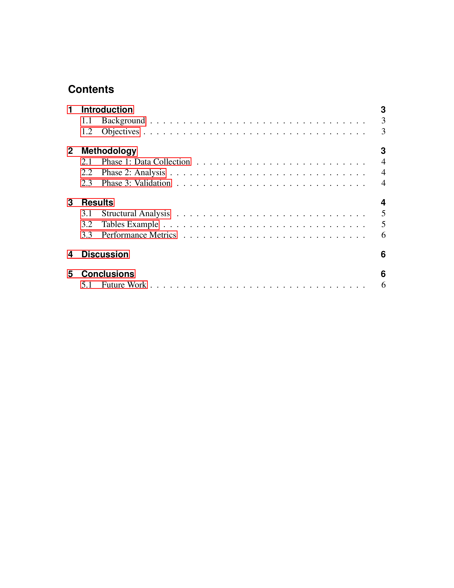
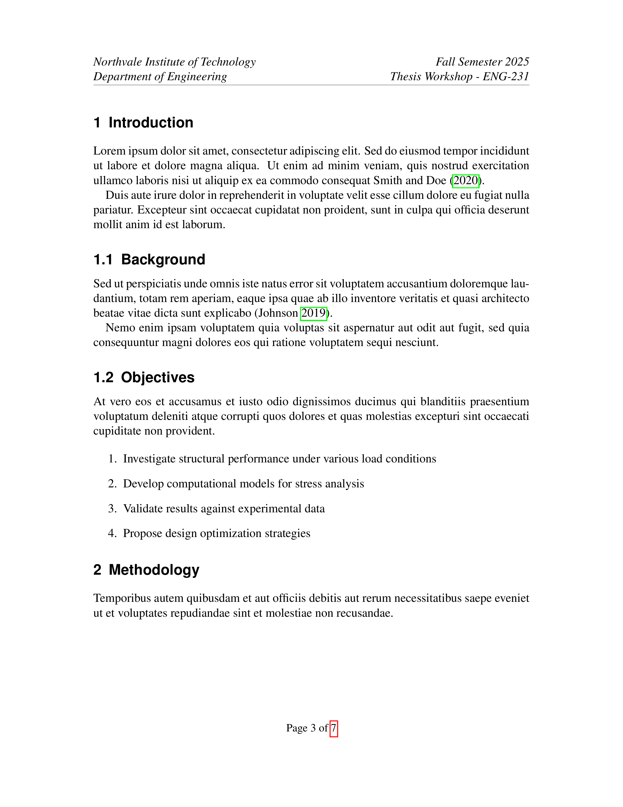
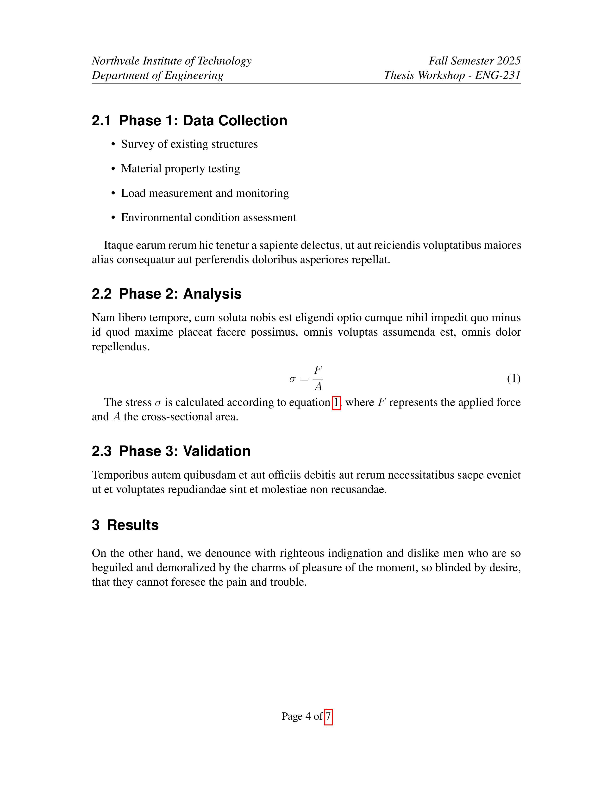
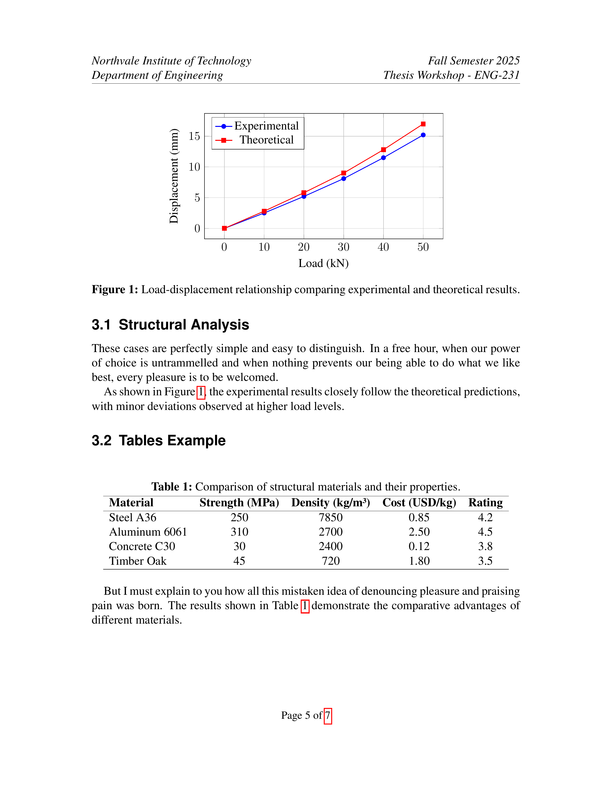

[LICENSE file](./LICENSE)# Simple Report Template

A **LaTeX** template for creating academic reports.

## Preview

Below are some example pages created with the Simple Report Template:

<p align="center">
  
  
</p>

<p align="center">
  
  
</p>

<p align="center">
  
</p>

## File Structure

```
simple-report-template/
├── template.tex                    # Main LaTeX document
├── simple-report-template.sty      # Custom style package
├── references.bib                  # Bibliography database
├── figures/                        # Folder for figures and images
│   └── example-plot.tex            # Example TikZ/PGFPlots plot
├── demo/                           # Preview images
└── README.md                       # This file
```


## License

This project is released under the Unlicense License, granting you complete freedom to use, modify, and distribute the template. For more details, see the [LICENSE file](./LICENSE) file.

